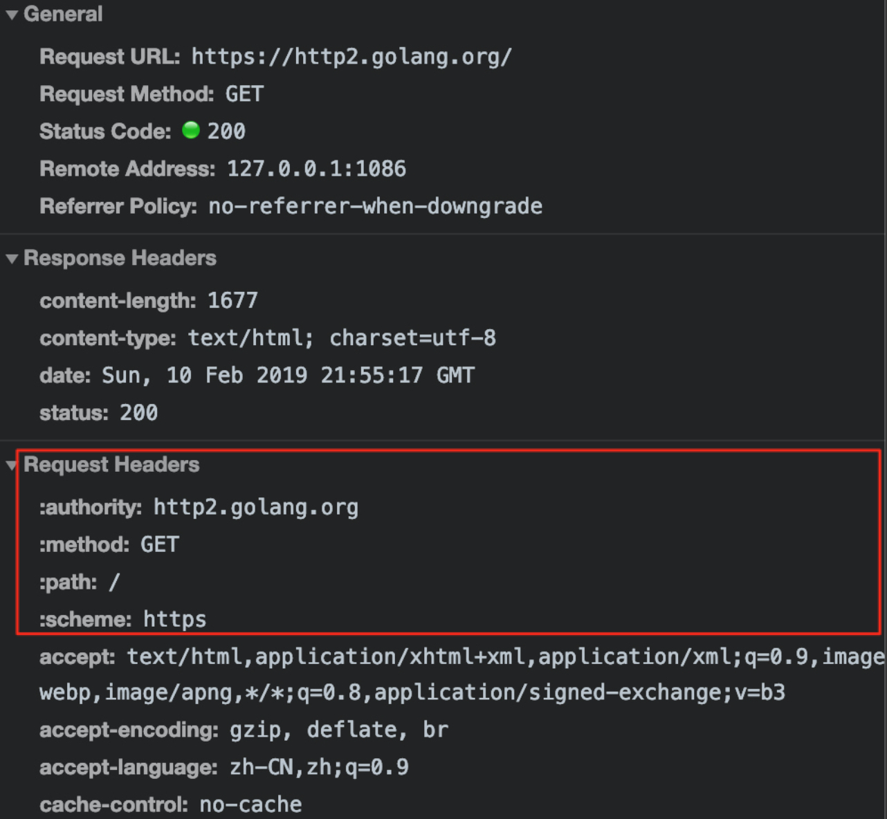
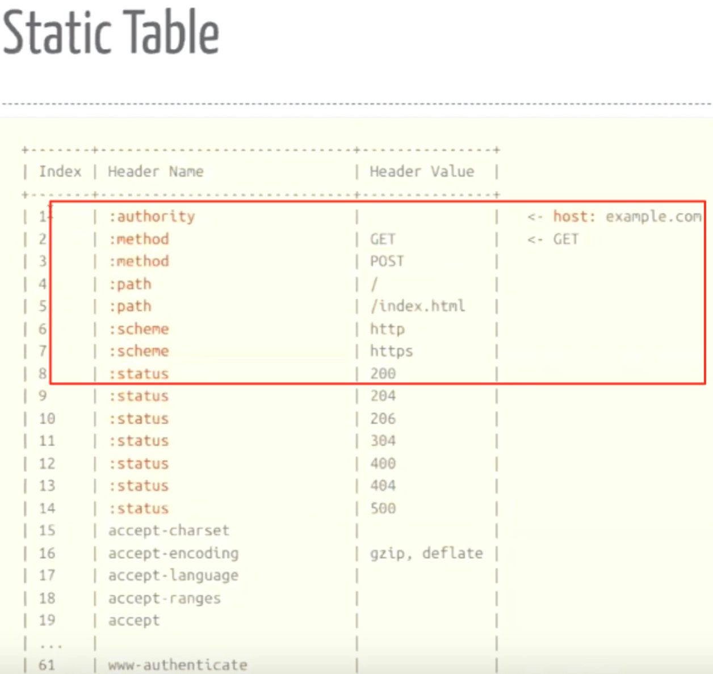
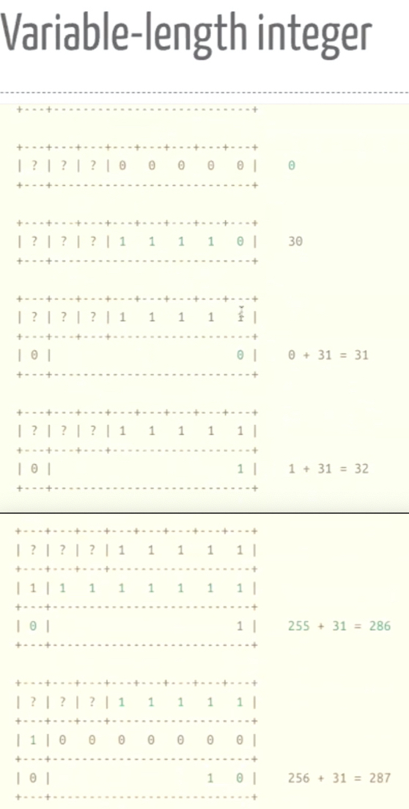
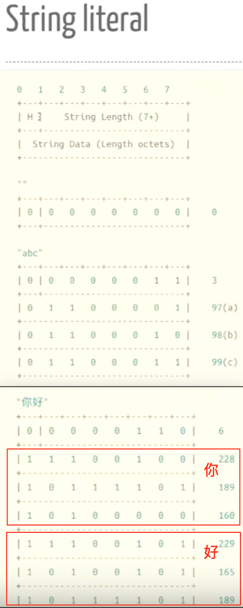
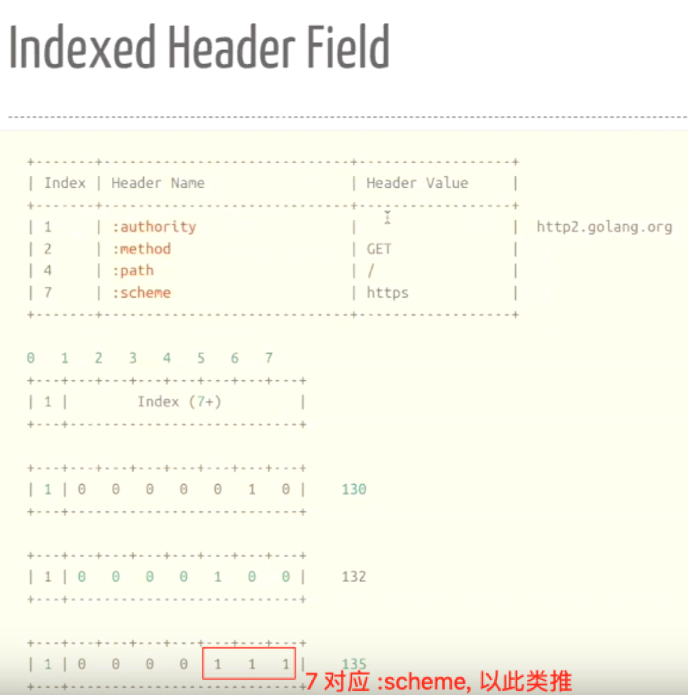
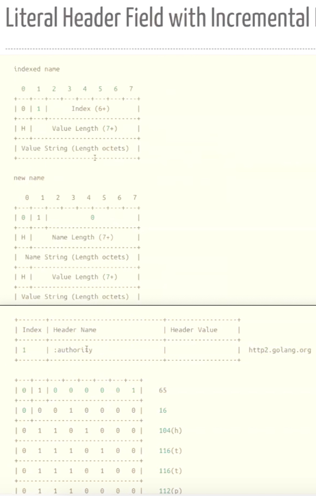
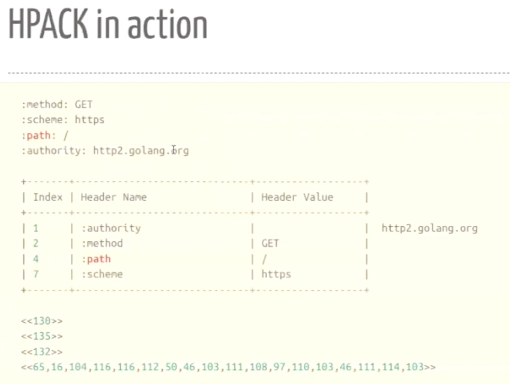

### **HTTP/2 features**

- One TCP Connection
- Binary Protocol
- Multiplexed(多路复用)
- Flow Control and Prioritization (WINDOWS_UPDATE,PRIORITY)
- Header Compression
- Server Push
- Encrypted


```
-module(h2).
-export([start/1,init/1]).

start(Host) ->
    spawn(h2,init,[Host]).

init(Host) ->
    {ok,Socket} = ssl:connect(Host,443,[
        binary,
        {alpn_advertised_protocols,[<<"h2">>]}
        ]),
    loop(Socket).

loop(Socket) ->
    receive
        {ssl,Socket,Data} ->
            io:format("Socket got ~w~n",[Data]),
            loop(Socket)
    end.
```
```
erl -s ssl
c(h2),f(P),P=h2:start("http2.golang.org").
```
服务端返回的讯息通过 `io:format("Socket got ~w~n",[Data])`显示如下内容:
```
Socket got <<0,0,24,4,0,0,0,0,0,0,5,0,16,0,0,0,3,0,0,0,250,0,6,0,16,1,64,0,4,0,16,0,0>>
```
这里 0,0,24 表示 Length ; 4,0 表示 Type 为 SETTINGS
<div style="display: flex; flex-direction: row; justify-content: space-between;">

 
</div>

<br>
为什么是 SETTINGS ? 可以对照这张表: 

 
DATA: 真实数据;

WINDOW_UPDATE: flow control

SETTINGS: 设置的内容包括下表的所有字段;

如果有没返回的字段: HEADER_TABLE_SIZE 和 ENABLE_PUSH , 则采用默认值

<div style="display: flex; flex-direction: row; justify-content: space-between;">
    
    
</div>


客户端需要发送一个 Magic 8字节流,再接一个 SETTINGS 帧, 来建立HTTP/2的连接; 只有支持 HTTP/2 的服务器可以识别这个 SETTINGS 帧，并回复一个 SETTINGS 帧表示连接成功。
```
init(Host) ->
    {ok,Socket} = ssl:connect(Host,443,[
        binary,
        {alpn_advertised_protocols,[<<"h2">>]}
        ]),
    Magic = "PRI * HTTP/2.0\r\n\r\nSM\r\n\r\n",
    Settings = <<0,0,0,4,0,0,0,0,0>>,
    ssl:send(Socket,[Magic,Settings]),
    loop(Socket).
```
服务端返回的信息: 
0,0,4,8 的 Type 为 WINDOW_UPDATE; 
<<0,0,0,4,1,0,0,0,0>> Flags 为 1, 是对客户端 Settings <<0,0,0,4,0,0,0,0,0>> 的 ack
```
Socket got <<0,0,24,4,0,0,0,0,0,0,5,0,16,0,0,0,3,0,0,0,250,0,6,0,16,1,64,0,4,0,16,0,0>>
Socket got <<0,0,4,8,0,0,0,0,0,0,15,0,1>>
Socket got <<0,0,0,4,1,0,0,0,0>>
```
解析上面的信息:
```
parse(<<_:24,4,0,_/binary>>) -> io:format("Got SETTINGS~n");
parse(<<_:24,4,1,_/binary>>) -> io:format("Got SETTINGS_ACK~n");
parse(<<_:24,8,_/binary>>) -> io:format("Got WINDOWN_UPDATE~n");
```
```
Got SETTINGS
Got WINDOWN_UPDATE
Got SETTINGS_ACK
```

HPACK 是一种表查找压缩方案，使用 Huffman 编码, 在客户端和服务端各维护两张这样的表: 一张是静态表，用于查找最常用且固定的 61 个 Header Name/Value 组成; 一张动态表，记录不在静态表中的 Header, Index 从 62 开始.
<div style="display: flex; flex-direction: row; justify-content: space-between;">


</div>

`:authority: http2.golang.org` 在动态表中会如何表示呢?

<div style="display: flex; flex-direction: row; justify-content: space-between;">


</div>

静态表:


动态表不会无限添加下去, 视 SETTINGS 的 HEADER_TABLE_SIZE 而定:


最终呈现的效果:
<div style="display: flex; flex-direction: row; justify-content: space-between;">


</div>

