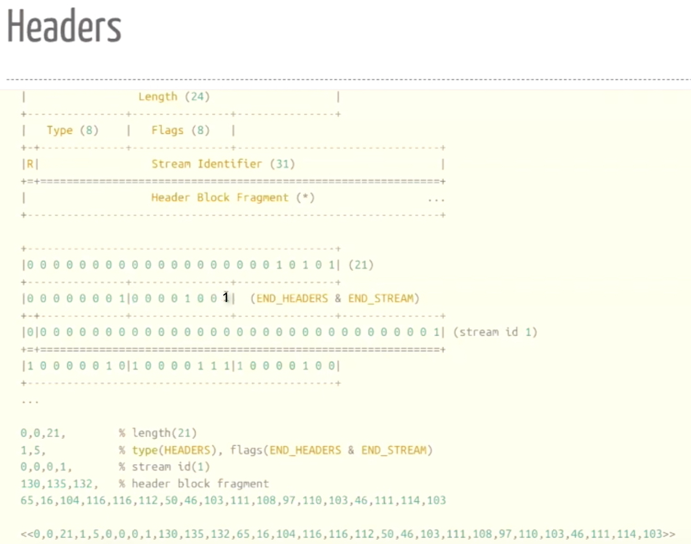

### **HTTP/2 features**

- One TCP Connection
- Binary Protocol
- Multiplexed(多路复用)
- Flow Control and Prioritization (WINDOWS_UPDATE,PRIORITY)
- Header Compression
- Server Push
- Encrypted


```
-module(h2).
-export([start/1,init/1]).

start(Host) ->
    spawn(h2,init,[Host]).

init(Host) ->
    {ok,Socket} = ssl:connect(Host,443,[
        binary,
        {alpn_advertised_protocols,[<<"h2">>]}
        ]),
    loop(Socket).

loop(Socket) ->
    receive
        {ssl,Socket,Data} ->
            io:format("Socket got ~w~n",[Data]),
            loop(Socket)
    end.
```
```
~ erl -s ssl
> c(h2),f(P),P=h2:start("http2.golang.org").
```
服务端返回的讯息通过 `io:format("Socket got ~w~n",[Data])`显示如下内容:
```
Socket got <<0,0,24,4,0,0,0,0,0,0,5,0,16,0,0,0,3,0,0,0,250,0,6,0,16,1,64,0,4,0,16,0,0>>
```
这里 0,0,24 表示 Length ; 4 表示 Type 为 SETTINGS
<div style="display: flex; flex-direction: row; justify-content: space-between;">

 
</div>

<br>
对照下面这张 Type 的查询表: 

0 - DATA: 表示返回了请求的数据;

8 - WINDOW_UPDATE: flow control


4 - SETTINGS: 设置的内容包括以下这些字段;

如果有没返回的字段如: HEADER_TABLE_SIZE 和 ENABLE_PUSH , 则采用默认值

<div style="display: flex; flex-direction: row; justify-content: space-between;">
    
    
</div>

客户端需要发送一个 Magic 8字节流,再接一个 SETTINGS 帧, 来建立HTTP/2的连接; 只有支持 HTTP/2 的服务器可以识别这个 SETTINGS 帧，并回复一个 SETTINGS 帧表示连接成功。
```
init(Host) ->
    {ok,Socket} = ssl:connect(Host,443,[
        binary,
        {alpn_advertised_protocols,[<<"h2">>]}
        ]),
    Magic = "PRI * HTTP/2.0\r\n\r\nSM\r\n\r\n",
    Settings = <<0,0,0,4,0,0,0,0,0>>,
    ssl:send(Socket,[Magic,Settings]),
    loop(Socket).
```
服务端返回的信息: 
0,0,4,(8) 的 Type 为 WINDOW_UPDATE; 
<<0,0,0,4,1,0,0,0,0>> Flags 为 1, 是对客户端 Settings <<0,0,0,4,0,0,0,0,0>> 的 ack .
```
Socket got <<0,0,24,4,0,0,0,0,0,0,5,0,16,0,0,0,3,0,0,0,250,0,6,0,16,1,64,0,4,0,16,0,0>>
Socket got <<0,0,4,8,0,0,0,0,0,0,15,0,1>>
Socket got <<0,0,0,4,1,0,0,0,0>>
```
解析上面的信息:
```
parse(<<_:24,4,0,_/binary>>) -> io:format("Got SETTINGS~n");
parse(<<_:24,4,1,_/binary>>) -> io:format("Got SETTINGS_ACK~n");
parse(<<_:24,8,_/binary>>) -> io:format("Got WINDOWN_UPDATE~n");
```
```
Got SETTINGS
Got WINDOWN_UPDATE
Got SETTINGS_ACK
```

**Header Compression**

GET 请求需要在 Request Headers 中设置 `:method: GET` 等请求头信息.

而 HTTP/2 连接会对头部信息进行压缩. HPACK 是一种表查找压缩方案，使用了 Huffman 编码; 客户端和服务端各维护了两张这样的表: 一张是静态表，用于查找最常用的 61 个 Header ; 一张动态表，记录 Value 不固定的或者 Name 不在静态表中的 Header, Index 从 62 开始.

<div style="display: flex; flex-direction: row; justify-content: space-between;">


</div>

<br>

**HPACK:**

<div style="display: flex; flex-direction: row; justify-content: space-between;">


</div>

```
0b10_0001100_0010000 + 31 = 34251
```

静态表中的 Header 压缩后都对应一个固定的值(因为 Name 和 Value 都是固定值):


动态表添加 Header:

1. `:authority:` 是一个 `indexed name` . 65 代表它在静态表中的 Index=1 ; 16 代表 value `http2.golang.org` 的长度;

2. Header Name 不在静态表中的要按照 `new name` 的格式进行添加.

3. 成功添加到动态表之后, 如果再一次发送这个 Header 就可以在**动态表**中查找对应的 Index 了, 如 190 在动态表中对应的 Index 为 62.

4. 动态表中的 Header 不会无限添加下去, 视 SETTINGS 的 HEADER_TABLE_SIZE 而定.

<div style="display: flex; flex-direction: row; justify-content: space-between;">


</div>

最终呈现的效果:
<div style="display: flex; flex-direction: row; justify-content: space-between;">


</div>

```
 {send,Data} ->
    ssl:send(Socket,Data),
    loop(Socket)
```
进程接收到 send 函数直接通过 `ssl:send` 发送 data .
```
P ! {send,<<0,0,21,1,5,0,0,0,1,130,135,132,1,16,104,116,116,112,50,46,103,111,108,97,110,103,46,111,114,103>>}.
```
```
 ... ...
<p>Congratulations, <b>you're using HTTP/2 right now</b>.</p>
 ... ...
```


